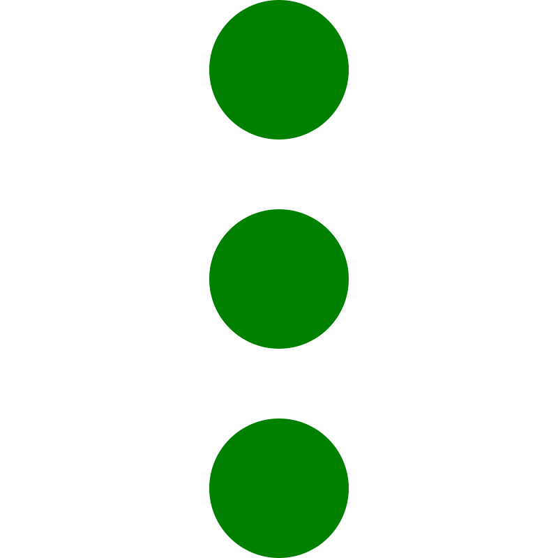

# Markdown Editor User Guide

Welcome to the Markdown Editor! This is a powerful tool for creating, editing, and managing Markdown files with versioning support and additional features. In this guide, you’ll learn how to use the editor, what features it offers, and how to interact with it.

---

## Main Interface

The editor is divided into several key areas:

1. **Tabs**
    - Located at the top of the window.
    - Each tab represents an open Markdown file.
    - Click a tab to switch to it.
    - Drag tabs to rearrange their order.

2. **Actions Panel**
    - Positioned below the tabs.
    - Contains buttons to switch editor views and a context menu for settings.

3. **Editing Area**
    - Occupies the main part of the window.
    - Supports two display modes: one-sided and two-sided.

4. **Information Panel**
    - Located at the bottom.
    - Displays the file path and statistics (characters, words, lines, etc.).

5. **Versions Panel**
    - Positioned to the right of the editor.
    - Shows a list of versions for the current file with management options.

---

## How to Interact with the Editor

### Opening and Creating Files
- **Opening a File**:
    - Click a Markdown file (`.md`) or use the "Add New File" function.
    - The file will open in a new tab.

- **Creating a New File**:
    - Click the "Create Note" icon and specify a file name.

### Working with Tabs
- **Switching**: Click a tab to make it active.
- **Closing**: Click `×` on a tab (if it’s not pinned).
- **Pinning**: Right-click a tab and select "Pin" from the context menu. Pinned tabs don’t show a close button.
- **Rearranging**: Hold and drag a tab to a new position.
- **Additional Actions**: Right-click a tab to open a context menu with options:
    - Pin/Unpin
    - Close
    - Close Other Tabs
    - Close All Tabs

### Editing Text
- **Two-Sided Mode (Two Panels)**:
    - Left: Text area for entering Markdown.
    - Right: Rendered output in HTML format.
    - Type text on the left, and it automatically appears on the right.

- **One-Sided Mode (Single Panel)**:
    - Text is displayed line by line.
    - Click a line to edit it in an input field.
    - Press `Enter` or lose focus to save changes.

- **Switching Modes**:
    - Use the buttons:
        -  — Switch to one-sided mode.
        -  — Switch to two-sided mode.

### Managing Versions
- **Versions Panel**:
    - Located on the right.
    - Displays a list of versions for the current file with version number (e.g., `v1`), name, size, and creation date.

- **Version Actions**:
    - **Search**: Enter a query in the search field above the version list to filter by name, number, or date.
    - **Select**: Click a version to make it active (highlighted in green).
    - **Create**: Click  to create a new version of the current document.
    - **Delete**: Click  to remove the active version.
    - **Restore**: Click  to replace the current content with the active version.
    - **Export**: Click  to save the active version as a separate file.
### Additional Features
- **Settings Context Menu**:
    - Click the  icon.
    - Opens a menu with options like text-to-speech, translation, and more (depending on implementation).

- **Statistics**:
    - Displays:
        - Number of characters, words, and lines.
        - Estimated reading time.
        - Number of headings.
    - Updates automatically as you edit.

- **Text-to-Speech**:
    - Use the settings context menu to select "Voice Text" (male or female voice).
    - Opens a player with the selected text.

---

## Useful Tips
- **Scrolling**: All areas with long content have a green scrollbar for convenience.
- **Line Highlighting**: In two-sided mode, the current line is highlighted with a light green background.
- **Saving Changes**: Not explicitly implemented yet, but you can export versions to save your work.
- **Text Translation**: Available in the settings context menu (e.g., from Russian to English).

---

## Supported Formats
- The editor works with Markdown files (`.md`).

---

## Troubleshooting
- Check your internet connection (some features, like translation, may require it).
- Contact the developer if you encounter issues or want to suggest improvements.

---

Thank you for using the Markdown Editor! If you have questions, reach out to support or review this file again. Happy editing!